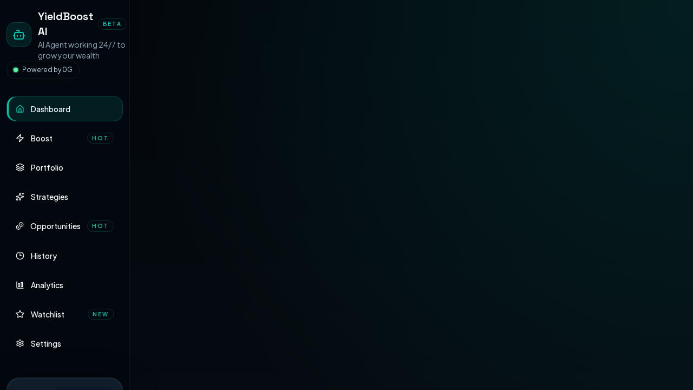
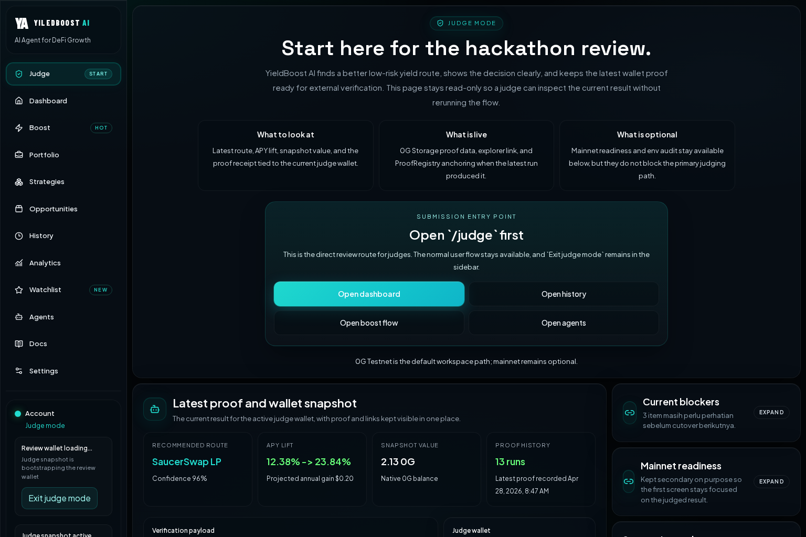
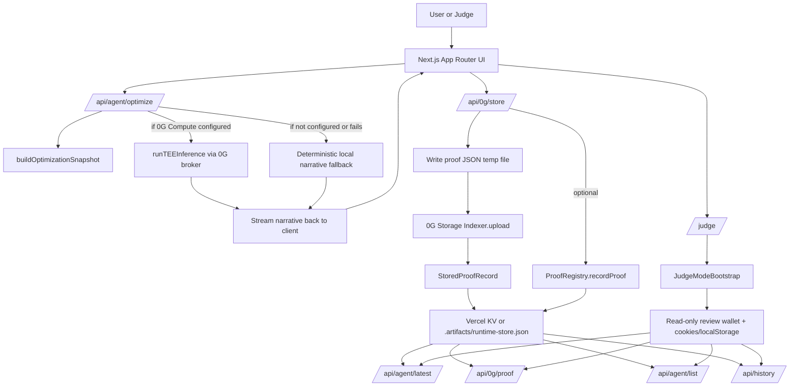
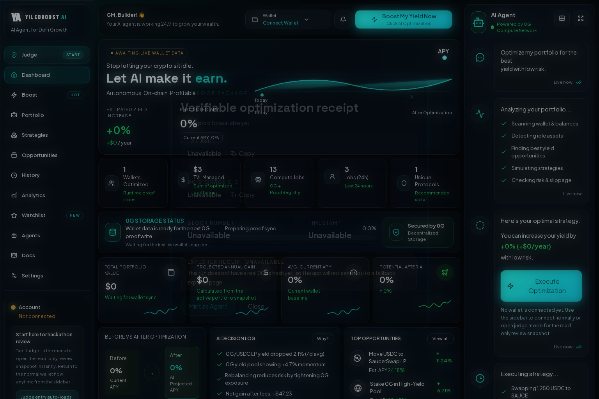

<p align="center">
  
</p>

<h1 align="center">YieldBoost AI</h1>

<p align="center"><strong>Verifiable yield optimization for Web3 users, with frictionless hackathon audit for judges.</strong></p>

<p align="center">
  
  
  
  
  
  
  
</p>

<p align="center">
  <a href="https://x.com/YieldboostAi">X: @YieldboostAi</a>
</p>

<p align="center">
  <a href="#why-this-matters">Why it matters</a> •
  <a href="#mainnet-live-verification">Mainnet verification</a> •
  <a href="#hackathon-track-alignment">Track alignment</a> •
  <a href="#fast-judge-review">Fast judge review</a> •
  <a href="#architecture">Architecture</a> •
  <a href="#0g-native-data-flow">0G data flow</a> •
  <a href="#agent-nft-layer">Agent NFT layer</a> •
  <a href="#local-installation">Local setup</a> •
  <a href="#testnet-secondary-path">Testnet secondary path</a> •
  <a href="#roadmap-ya0g-and-proof-of-optimization">Roadmap</a>
</p>

> YieldBoost AI is now positioned around a live 0G mainnet proof flow: generate a yield optimization result, persist it through 0G infrastructure, and let a judge verify the latest outcome from `/judge` without wallet friction.

YieldBoost AI is a Next.js application that turns a yield optimization run into an externally reviewable proof trail. The active implementation in this repository is now centered on a **mainnet-first** review path across three 0G primitives:

- **0G Compute** for TEE-ready inference when provider credentials are configured.
- **0G Storage** for storing optimization proof payloads.
- **ProofRegistry** for on-chain anchoring of those stored proofs on the active network.

The result is a product story judges can verify quickly: a user runs an optimization, the app persists the reasoning and decision payload on 0G infrastructure, and `/judge` exposes the latest mainnet review snapshot without requiring wallet connection, faucet setup, or rerunning the flow.

On top of that proof path, YieldBoost AI also ships a **Strategy Agent NFT layer** through `YieldStrategyINFT`, so a verified optimization can be elevated into a portable on-chain strategy artifact instead of remaining only as an off-chain UI event.

## Mainnet Live Verification

The current public deployment is now **mainnet-default**.

| Artifact | Value |
| --- | --- |
| Mainnet `ProofRegistry` | [`0x8e63e117E71A80Cfc10fDF375F079e2e29cd7D7D`](https://chainscan.0g.ai/address/0x8e63e117E71A80Cfc10fDF375F079e2e29cd7D7D) |
| Mainnet `YieldStrategyINFT` | [`0xb264D861264B0e4f8fb98A61B7694BA8a3B6BBe3`](https://chainscan.0g.ai/address/0xb264D861264B0e4f8fb98A61B7694BA8a3B6BBe3) |
| Mainnet attestation oracle | [`0x216E7880D64D94335B583c539802d3e61958d4A2`](https://chainscan.0g.ai/address/0x216E7880D64D94335B583c539802d3e61958d4A2) |
| Latest 0G Storage tx | [`0x4a186175bce710b8e7bdb8f07498ce733efc4f26bb17cba3bffd08dfa3a0f54d`](https://chainscan.0g.ai/tx/0x4a186175bce710b8e7bdb8f07498ce733efc4f26bb17cba3bffd08dfa3a0f54d) |
| Latest `ProofRegistry` anchor tx | [`0xa76f59de764dfb5dcd2fae3e8dff53cb0e213bab89162e7b4de16962309caa9b`](https://chainscan.0g.ai/tx/0xa76f59de764dfb5dcd2fae3e8dff53cb0e213bab89162e7b4de16962309caa9b) |
| Latest Agent NFT mint tx | [`0x93c2600f0d576e8512b3d57afe4a495e17446bf91ad8d9e9333cb62bdd2adc19`](https://chainscan.0g.ai/tx/0x93c2600f0d576e8512b3d57afe4a495e17446bf91ad8d9e9333cb62bdd2adc19) |
| Judge entry point | [`/judge`](https://yieldboost-ai.vercel.app/judge) |

What this means in practice:

- `mainnet` is the default review path in the live app.
- `/judge` can still switch between mainnet and testnet when a reviewer wants comparison context.
- testnet remains available for iteration and fallback, but it is no longer the primary submission narrative.
- the same live stack also exposes a mainnet `YieldStrategyINFT` contract for strategy-agent minting.

## Why This Matters

Most DeFi dashboards can claim "AI". Very few make the output easy to audit.

YieldBoost AI is designed around **verifiable AI**, not just recommendation UX:

- The optimization result is serialized and uploaded through the 0G mainnet storage pipeline by default.
- The latest run is retained in a runtime proof ledger.
- The storage result is also anchored on-chain through `ProofRegistry`.
- The judge can open `/judge` first, inspect the latest wallet snapshot in read-only mode, and switch networks only if they want secondary context.

That combination is the project's strongest differentiator for a hackathon review setting.

## Hackathon Track Alignment

YieldBoost AI is positioned first and foremost for **Track 2: Agentic Trading Arena (Verifiable Finance)**.

Why this is the strongest fit:

- The core product is an **AI yield optimizer** for Web3 portfolios.
- The live implementation turns each optimization run into a **verifiable finance artifact** through **0G Storage** and **ProofRegistry** anchoring on 0G mainnet.
- The compute path is built around **0G Compute** with a TEE-oriented inference route when credentials are available.
- `/judge` reduces review friction by exposing the latest proof-backed result without requiring wallet connection or faucet setup.

Secondary alignment:

- **Track 1: Agentic Infrastructure & OpenClaw Lab** because the repo includes an agent-style orchestration path, proof ledger, and contract-backed strategy extension flow.
- **Track 5: Privacy & Sovereign Infrastructure** as a supporting angle because the architecture already incorporates TEE-oriented compute, proof persistence, and auditable execution surfaces.

The submission story, however, is clearest when framed as **verifiable DeFi intelligence on 0G**, which is why Track 2 is the primary category for this project.

## Showcase

<table>
  <tr>
    <td width="50%">
      
    </td>
    <td width="50%">
      
    </td>
  </tr>
  <tr>
    <td align="center"><strong>Dashboard</strong><br />Portfolio intelligence, proof-aware UX, and optimization entry point.</td>
    <td align="center"><strong>Judge Mode</strong><br />Read-only audit route with latest proof, wallet snapshot, and verification links.</td>
  </tr>
</table>

## Fast Judge Review

| Step | What the judge sees | Why it matters |
| --- | --- | --- |
| 1 | Open `/judge` | Starts directly on the audit-first route instead of a wallet setup screen. |
| 2 | Review latest proof snapshot | Shows route recommendation, APY lift, wallet snapshot, and reasoning in one place. |
| 3 | Open explorer links | Lets the judge inspect the latest 0G mainnet storage tx and ProofRegistry anchor directly. |
| 4 | Navigate deeper only if needed | `/history` and `/agents` remain available without breaking the review flow. |

## Architecture



## 0G-Native Data Flow

1. The client calls [`/api/agent/optimize`](app/api/agent/optimize/route.ts), which builds a deterministic optimization snapshot and then attempts **0G Compute** inference through [`lib/server/og-compute.ts`](lib/server/og-compute.ts).
2. If the compute provider is available, the app requests a `chat/completions` inference response from the 0G serving broker and returns the streamed narrative to the UI.
3. The client then posts the finalized decision payload to [`/api/0g/store`](app/api/0g/store/route.ts).
4. That route writes a JSON proof artifact, uploads it through **0G Storage** using `Indexer.upload`, and records the resulting storage hash and tx metadata.
5. If `ProofRegistry` is configured, the same route calls `recordProof(...)` on the on-chain registry contract defined in [`contracts/ProofRegistry.sol`](contracts/ProofRegistry.sol).
6. The full proof record is persisted into the runtime ledger managed by [`lib/server/runtime-store.ts`](lib/server/runtime-store.ts), backed by **Vercel KV** when available or `.artifacts/runtime-store.json` as a local fallback.
7. The proof can then be rehydrated across the product through:
   - [`/api/agent/latest`](app/api/agent/latest/route.ts)
   - [`/api/0g/proof`](app/api/0g/proof/route.ts)
   - [`/api/history`](app/api/history/route.ts)
   - [`/api/agent/list`](app/api/agent/list/route.ts)
8. The judge opens [`/judge`](<app/(workspace)/judge/page.tsx>), which surfaces the latest proof, wallet snapshot, explorer links, registry status, and a compact network switcher in one audit-first page.

## Agent NFT Layer

YieldBoost AI is not only storing optimization proofs. It also turns a completed proof-backed strategy into a **Strategy Agent NFT** on 0G mainnet.

- [`contracts/YieldStrategyINFT.sol`](contracts/YieldStrategyINFT.sol) is the on-chain contract for the strategy NFT layer.
- [`/api/agent/mint`](app/api/agent/mint/route.ts) mints the NFT from a live optimization result, using the connected wallet as the NFT recipient.
- [`contracts/AttestationRegistryOracle.sol`](contracts/AttestationRegistryOracle.sol) now backs the optional on-chain attestation path so broker-verified compute hashes can be registered before minting.
- [`/api/agent/list`](app/api/agent/list/route.ts) reads back minted strategy agents from the contract, with a graceful proof-history fallback when contract mode is unavailable.
- The NFT payload carries the optimization context: APY delta, strategy reasoning, proof hash references, and attestation-linked metadata.

Why this matters for judging:

- it shows YieldBoost AI is not only a dashboard, but also an **agent identity / strategy ownership layer**
- it aligns the product with 0G's broader direction around **Agent ID-style composable intelligence**
- it gives the project a second verifiable asset surface beyond storage proofs and registry anchors

## What Is Actually Live In This Repo

### Verifiable AI Pipeline

- **0G Compute-first inference path**: the live optimize route attempts TEE-ready inference through the 0G broker and falls back honestly when the provider is unavailable.
- **0G Storage proof persistence**: every successful proof write stores decision metadata, timestamps, wallet scope, and explorer links.
- **Optional on-chain ProofRegistry anchoring**: if the registry contract env is present, the proof is also recorded on-chain and surfaced with a registry tx hash and proof id.
- **Runtime proof ledger**: proofs are queryable later without re-running the optimization.

### Frictionless Judge Experience

- **`/judge` is the intended submission entry point** and defaults to the current mainnet review path.
- **No wallet connection is required** for review.
- **No faucet step is required** for the judge to inspect the latest recorded result.
- **Read-only mode is explicit**: `JudgeModeBootstrap` sets judge mode state, scopes the session to the review wallet, and keeps the main flow non-destructive.
- **Mainnet is the default review network** while testnet stays available as secondary context from the same page.
- **The UX is tested** in Playwright, including direct judge entry, cross-page hydration, and judge-mode exit behavior.

### Agent / INFT Extension Path

- [`contracts/YieldStrategyINFT.sol`](contracts/YieldStrategyINFT.sol) defines the Strategy Agent NFT contract.
- [`/api/agent/mint`](app/api/agent/mint/route.ts) can mint a strategy NFT using a stored strategy payload, a content hash, APY in basis points, and an attestation hash.
- [`/api/agent/list`](app/api/agent/list/route.ts) reads live contract data when the INFT contract is configured.
- If the contract path is not configured, the gallery degrades gracefully to **proof-backed runtime history** instead of failing.

## Judge Mode Highlight

`/judge` is not a cosmetic dashboard variant. It is a purpose-built audit surface for hackathon evaluation.

It does four important things:

- **Bootstraps a review wallet automatically** when no wallet is connected.
- **Pins the review flow to the latest recorded proof**, so judges see a concrete result first.
- **Defaults the review path to mainnet**, which matches the current live submission story.
- **Keeps proof links, CID/root hash, registry status, and snapshot details on one page**, minimizing review friction.

This is the UX decision that makes YieldBoost AI unusually judge-friendly: the verification path is short, visible, and does not depend on extension setup.

<p align="center">
  
</p>

<p align="center"><em>Proof modal showing the storage-backed verification layer exposed to the reviewer.</em></p>

## Technical Notes That Matter

### 0G Components Used

| 0G primitive | Where it appears | What it does |
| --- | --- | --- |
| 0G Compute | [`lib/server/og-compute.ts`](lib/server/og-compute.ts) | Initializes the broker, funds the inference sub-account when needed, acknowledges provider signer, and performs inference requests. |
| 0G Storage | [`app/api/0g/store/route.ts`](app/api/0g/store/route.ts) | Uploads the optimization proof payload through the 0G SDK indexer. |
| ProofRegistry | [`contracts/ProofRegistry.sol`](contracts/ProofRegistry.sol) and [`app/api/0g/store/route.ts`](app/api/0g/store/route.ts) | Anchors proof metadata on-chain and emits `ProofRecorded`. |

### Token / Prompt Efficiency

The active runtime now includes a real efficiency stack, not just short prompts:

- **Dedicated prompt compression** in [`lib/server/prompt-compression.ts`](lib/server/prompt-compression.ts):
  - normalizes noisy user prompts
  - summarizes the live portfolio into a compact holdings string
  - rewrites the request into a stable intent-and-constraint format before inference
- **Semantic cache keys** in [`lib/server/optimization-cache.ts`](lib/server/optimization-cache.ts):
  - wallet-aware
  - network-aware
  - prompt-aware
  - portfolio-aware
- **Embedding-based prompt reuse** via Alibaba DashScope `text-embedding-v4` in [`lib/server/alibaba-embeddings.ts`](lib/server/alibaba-embeddings.ts), with similarity matching against recent cached optimization requests for the same wallet/network/asset signature
- The 0G Compute system instruction still forces a **short response under 60 words**
- The inference request still uses **`temperature: 0.2`** and **`max_tokens: 512`**

In practice, the route now tries:

1. exact semantic cache hit  
2. embedding-based reuse hit  
3. live 0G Compute inference  
4. deterministic local fallback

So the honest positioning is now: **YieldBoost AI actively reduces repeated token spend and prompt bloat while preserving the same proof-backed output flow**.

### Integrity Hardening

- **Agent NFT metadata encryption** now uses **AES-256-GCM** in [`lib/server/encryption.ts`](lib/server/encryption.ts), with a required `STRATEGY_METADATA_ENCRYPTION_KEY` and a backward-compatible decrypt path for earlier base64 test payloads.
- **0G Compute response validation** now uses the broker verification path in [`lib/server/og-compute.ts`](lib/server/og-compute.ts): the app verifies the returned chat ID through the broker and confirms the signed response body matches the text surfaced in the UI before marking the proof as TEE-verified.
- **Agent NFT attestation hashes** are now derived from the runtime attestation payload when a verified 0G Compute result is present, rather than from a generic placeholder string.
- **On-chain INFT verification** now has a live contract path through [`contracts/AttestationRegistryOracle.sol`](contracts/AttestationRegistryOracle.sol): verified attestation hashes can be registered on-chain before `YieldStrategyINFT` mints, allowing the contract's `verified` flag to reflect oracle state instead of staying permanently disabled.

## Honest Fallback Design

One of the strongest implementation details here is that the app does not fake liveness:

- If **0G Compute** is unavailable, optimization narration falls back locally.
- If **0G Compute** falls back locally, Agent NFTs can still mint, but the on-chain `verified` flag remains false because no broker-verified attestation hash exists to register.
- If **0G Storage** fails, the UI still shows the optimization result but marks proof sync failure honestly.
- If **ProofRegistry** is not configured, storage still succeeds and the record is marked accordingly.
- If **Vercel KV** is missing, runtime history falls back to `.artifacts/runtime-store.json`.
- If **INFT contract envs** are missing, `/agents` switches to proof-backed history mode.

That behavior is much better for judge trust than pretending every subsystem is always live.

## Key Routes

| Route | Purpose |
| --- | --- |
| `/judge` | Read-only judge entry point with latest proof, wallet snapshot, and infra status. |
| `/agent` | Main optimization execution experience. |
| `/agents` | Agent gallery, backed by contract mode or proof fallback mode. |
| `/api/agent/optimize` | 0G Compute-first optimization narration endpoint. |
| `/api/0g/store` | 0G Storage upload and optional ProofRegistry anchoring. |
| `/api/0g/proof` | Retrieve the latest stored proof or fetch proof data by CID/hash. |
| `/api/agent/latest` | Rehydrate the latest proof-backed optimization result for a wallet. |
| `/api/history` | Proof-backed execution history for the active wallet. |

## Local Installation

### 1. Install dependencies

```bash
npm install
```

### 2. Create `.env.local`

Minimum setup for local judge flow and **mainnet-first** proof writes:

```env
NEXT_PUBLIC_APP_URL=http://localhost:3000
NEXT_PUBLIC_DEMO_WALLET_ADDRESS=0x8a3c7524Aaed081825aC88eC7f4cCECFc583ee7D

NEXT_PUBLIC_0G_MAINNET_CHAIN_ID=16661
NEXT_PUBLIC_0G_MAINNET_CHAIN_NAME=0G Mainnet
NEXT_PUBLIC_0G_MAINNET_EXPLORER_BASE_URL=https://chainscan.0g.ai
NEXT_PUBLIC_0G_MAINNET_RPC=https://evmrpc.0g.ai
NEXT_PUBLIC_0G_MAINNET_STORAGE=https://indexer-storage-turbo.0g.ai

NEXT_PUBLIC_0G_TESTNET_CHAIN_ID=16602
NEXT_PUBLIC_0G_TESTNET_CHAIN_NAME=0G Galileo Testnet
NEXT_PUBLIC_0G_EXPLORER_BASE_URL=https://chainscan-galileo.0g.ai
NEXT_PUBLIC_ZG_RPC=https://evmrpc-testnet.0g.ai
NEXT_PUBLIC_ZG_STORAGE=https://indexer-storage-testnet-turbo.0g.ai

ZG_NETWORK_KEY=mainnet
ZG_MAINNET_RPC_URL=https://evmrpc.0g.ai
ZG_MAINNET_STORAGE_URL=https://indexer-storage-turbo.0g.ai
ZG_MAINNET_PRIVATE_KEY=<mainnet_signer_private_key>
ZG_MAINNET_PROOF_REGISTRY_ADDRESS=0x8e63e117E71A80Cfc10fDF375F079e2e29cd7D7D
YIELD_STRATEGY_INFT_MAINNET_ADDRESS=0xb264D861264B0e4f8fb98A61B7694BA8a3B6BBe3
YIELD_STRATEGY_ATTESTATION_ORACLE_MAINNET_ADDRESS=0x216E7880D64D94335B583c539802d3e61958d4A2
```

Optional but recommended:

```env
ZG_MAINNET_COMPUTE_PROVIDER_ADDRESS=<mainnet_compute_provider>
ZG_MAINNET_LEDGER_PRIVATE_KEY=<mainnet_compute_or_contract_signer>
KV_REST_API_URL=<optional_vercel_kv_url>
KV_REST_API_TOKEN=<optional_vercel_kv_token>
UPSTASH_REDIS_REST_URL=<optional_upstash_url>
UPSTASH_REDIS_REST_TOKEN=<optional_upstash_token>
ALIBABA_API_KEY=<dashscope_api_key>
ALIBABA_BASE_URL=https://dashscope-intl.aliyuncs.com/compatible-mode/v1
ALIBABA_MODEL=qwen3.6-plus-2026-04-02
ALIBABA_EMBEDDING_MODEL=text-embedding-v4
ALIBABA_EMBEDDING_DIMENSION=512
STRATEGY_METADATA_ENCRYPTION_KEY=<64_hex_or_32_byte_base64_secret>
YIELD_STRATEGY_ATTESTATION_ORACLE_MAINNET_ADDRESS=<mainnet_attestation_oracle_address>
```

### 3. Run the app

```bash
npm run dev
```

Open `http://localhost:3000`, then review:

- `/judge` for the hackathon audit path
- `/agent` for optimization execution
- `/agents` for contract mode or proof-backed fallback mode

### 4. Verify locally

```bash
npm run lint
npm run build
npm run test:ui
```

### 5. Optional contract / broker scripts

```bash
npm run deploy:proof-registry:mainnet
npm run deploy:inft:mainnet
npm run deploy:attestation-oracle:mainnet
npm run configure:inft-oracle:mainnet
npm run setup:tee-broker:mainnet
```

## Testnet Secondary Path

Testnet is still available, but it is now a secondary path for:

- iteration
- comparison during judging
- fallback demos
- isolated testing of provider or wallet flows

If you want to run locally against testnet instead:

```env
ZG_NETWORK_KEY=testnet
ZG_TESTNET_RPC_URL=https://evmrpc-testnet.0g.ai
ZG_TESTNET_STORAGE_URL=https://indexer-storage-testnet-turbo.0g.ai
ZG_TESTNET_PRIVATE_KEY=<testnet_signer_private_key>
ZG_TESTNET_PROOF_REGISTRY_ADDRESS=<optional_testnet_registry>
ZG_TESTNET_COMPUTE_PROVIDER_ADDRESS=<optional_testnet_compute_provider>
ZG_TESTNET_LEDGER_PRIVATE_KEY=<optional_testnet_signer>
YIELD_STRATEGY_INFT_ADDRESS=<optional_testnet_inft_contract>
```

The UI and `/judge` can still switch between mainnet and testnet from the same deployment.

## Mainnet Submission Status

This repository is no longer in “mainnet prep only” mode. The current live state is:

- mainnet `ProofRegistry` deployed
- mainnet `YieldStrategyINFT` deployed
- mainnet storage tx and registry anchor already recorded
- live app defaults to mainnet
- judge mode can still switch to testnet when needed

Mainnet-related commands remain available for future redeployments or contract updates:

```bash
npm run deploy:proof-registry:mainnet
npm run deploy:inft:mainnet
npm run transfer:fund:broker:mainnet
npm run acknowledge:provider:mainnet
npm run setup:tee-broker:mainnet
```

## Repository Pointers

| File | Why it matters |
| --- | --- |
| [`app/api/agent/optimize/route.ts`](app/api/agent/optimize/route.ts) | Active optimization entry point. |
| [`lib/server/og-compute.ts`](lib/server/og-compute.ts) | 0G Compute broker integration. |
| [`app/api/0g/store/route.ts`](app/api/0g/store/route.ts) | Proof upload and registry anchoring. |
| [`lib/server/runtime-store.ts`](lib/server/runtime-store.ts) | Proof persistence layer. |
| [`app/(workspace)/judge/page.tsx`](<app/(workspace)/judge/page.tsx>) | Main judge review surface. |
| [`components/judge/JudgeModeBootstrap.tsx`](components/judge/JudgeModeBootstrap.tsx) | Wallet-free review bootstrap behavior. |
| [`contracts/ProofRegistry.sol`](contracts/ProofRegistry.sol) | On-chain proof registry. |
| [`contracts/YieldStrategyINFT.sol`](contracts/YieldStrategyINFT.sol) | Strategy Agent NFT contract. |

## Roadmap: $YA0G and Proof-of-Optimization

The items below are **future roadmap**, not current live functionality in this repository.

### `$YA0G` Utility Layer

- Reward wallets that submit optimization runs that are successfully stored and externally verifiable.
- Use proof-backed activity, not vanity clicks, as the basis for ecosystem participation.
- Align token utility with storage-backed execution history, strategy quality, and long-term protocol usage.

### Proof-of-Optimization Mining

- Introduce a mining model where emission is tied to **successful optimization proofs**, not raw prompt volume.
- Weight rewards by signals such as proof anchoring success, portfolio size bands, APY improvement bands, and repeat verifiability.
- Treat **ProofRegistry-backed executions** as the highest-quality mining events.

### Network Evolution

- Keep mainnet as the default public review path while preserving testnet as a secondary environment for experimentation and comparison.
- Add stronger proof economics around recurring optimization behavior and strategy sharing.
- Extend the current proof ledger into a richer reputation layer for agents, optimizers, and strategy curators.

## Closing Position

YieldBoost AI is strongest when presented as a **mainnet-live verifiable optimization product built around 0G infrastructure and judge-friendly audit UX**.

The implementation already proves the essential idea:

- **Compute can be routed through 0G**
- **proofs can be stored through 0G mainnet**
- **proofs can be anchored on-chain through ProofRegistry**
- **judges can review the latest result without wallet friction**

That is a much more compelling hackathon story than a generic AI dashboard, because the output is not only generated, but also reviewable.
