<p align="center">
  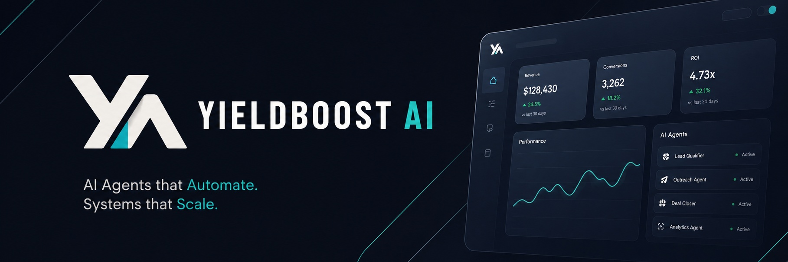
</p>

<h1 align="center">YieldBoost AI</h1>

<p align="center"><strong>Turn idle crypto balances into verifiable yield routes on 0G, with frictionless hackathon audit for judges.</strong></p>

<p align="center">
  
  
  
  
  
  
  
  
  
  
  
  
  
  
</p>

<p align="center">
  <a href="https://x.com/YieldboostAi">X: @YieldboostAi</a>
</p>

<p align="center">
  <a href="#why-this-matters">Why it matters</a> •
  <a href="#mainnet-live-verification">Mainnet verification</a> •
  <a href="#founder-grade-snapshot">Founder grade</a> •
  <a href="#the-problem">Problem</a> •
  <a href="#the-solution">Solution</a> •
  <a href="#hackathon-track-alignment">Track alignment</a> •
  <a href="#showcase">Showcase</a> •
  <a href="#fast-judge-review">Fast judge review</a> •
  <a href="#architecture">Architecture</a> •
  <a href="#0g-native-data-flow">0G data flow</a> •
  <a href="#0g-integration-upgrade">0G integration upgrade</a> •
  <a href="#9-layer-independence-and-partner-sdk-scope">9-layer independence</a> •
  <a href="#agent-nft-layer">Agent NFT layer</a> •
  <a href="#readme-stats">Stats</a> •
  <a href="#local-installation">Local setup</a> •
  <a href="#license">License</a> •
  <a href="#contributing">Contributing</a>
</p>

> YieldBoost AI is a mainnet-first 9-layer proof and security stack on 0G: users run 1-click optimize, developers buy the stack as APIs, and hackers can challenge the security model through the vault.

YieldBoost AI has three clear product surfaces built on one 9-layer stack:

- **For users:** 1-click optimize turns idle crypto balances into proof-backed yield routes.
- **For developers:** the API marketplace sells the same security stack as modular APIs and wrapped SDKs.
- **For public security testing:** the vault and anti-sybil airdrop example show how the system behaves under attacks, abuse, and high-volume claim flows.

Under the hood, those surfaces share the same proof path: 0G compute, ZK evidence, 0G Storage, ProofRegistry anchoring, and integrity memory.

The active implementation in this repository is now centered on a **mainnet-first** review path across the core 0G stack plus an integrity memory layer:

- **0G Compute** for broker-verified inference, with TEE response evidence surfaced when the provider path returns a verified response.
- **0G Storage** for storing optimization proof payloads.
- **ProofRegistry** for on-chain anchoring of those stored proofs on the active network.
- **Integrity Auditor** as a deterministic backend guardrail before any new proof write.
- **Sovereign Memory** for persistent agent state snapshots on 0G Storage.
- **Hallucination Blacklist** for pre-inference rejection of known bad patterns.
- **Multiverse Stress Test** for historical replay and 0G-backed Integrity Report Cards.

On top of that integrity memory stack, the repo now adds three review-grade control-plane features for verifiable reasoning and policy enforcement:

- **Zero-Knowledge Proof Layer** as a live TEE/ZK reasoning proof envelope persisted to 0G and anchored for Judge review.
- **Programmable AI Governance** as a deterministic policy engine that can keep a strategy `active`, `warning`, `throttled`, or `halted`.
- **Cross-Agent Neural Handshake** as a persisted optimizer-to-auditor transcript envelope recorded on 0G mainnet.
- **ZK Policy Seal** as the policy proof tying ZKR and governance back to the latest stored strategy execution.

The result is a product story judges can verify quickly: a user runs an optimization, the app persists the reasoning and decision payload on 0G infrastructure, and `/judge` exposes the latest mainnet review snapshot without requiring wallet connection, faucet setup, or rerunning the flow.

The network split is intentional and should be read honestly:

- **Mainnet-first product surfaces:** 1-click optimize, judge review, API / SDK marketplace, and the anti-sybil + ZK + Alibaba fingerprinting module.
- **Testnet-only public challenge surfaces:** vault challenge and the public anti-sybil airdrop example.
- **Why testnet still exists:** those two surfaces benefit from many external testers, and testnet lets people attack, retry, and learn the system without forcing every tester to spend mainnet gas.

On top of that proof path, YieldBoost AI also ships a **Strategy Agent NFT layer** through `YieldStrategyINFT`, so a verified optimization can be elevated into a portable on-chain strategy artifact instead of remaining only as an off-chain UI event.

## 9-Layer Independence and Partner SDK Scope

The YieldBoost AI 9-layer military-grade stack is built as a standalone verification system. Partner integrations such as VeilSolver can be wrapped by this stack, while the core YieldBoost proof flow remains self-contained.

The standalone YieldBoost stack includes:

1. Hallucination Blacklist
2. Integrity Auditor
3. Secure Compute / TEE
4. Sovereign Memory
5. 0G Storage Proof Layer
6. Zero-Knowledge Proof Layer
7. ProofRegistry Anchor
8. Programmable Governance
9. Cross-Agent Neural Handshake

VeilSolver Secure Proxy is a partner SDK example in the developer marketplace: YieldBoost wraps the partner solver with isolated execution, ZK proof packaging, and 0G anchoring so external developers can call a secured endpoint. The 9-layer military-grade stack remains YieldBoost's own verification layer, and partner SDKs can plug into it as secured modules.

## Founder Grade Snapshot

| Dimension | Current grade | Evidence |
| --- | --- | --- |
| Verifiability | A | 0G Storage proofs, ProofRegistry anchoring, explorer links, and `/judge` read-only review. |
| Agent memory | A- | `Sovereign Memory` snapshots persist context state and latest proof CID to 0G Storage. |
| AI safety | A- | Integrity Auditor blocks impossible outputs and indexes rejections into the hallucination blacklist. |
| Demo clarity | A | Judge Mode shows proof, memory, blacklist, stress report, and verification links without wallet setup. |
| Production honesty | A | 0G Compute, Storage, Registry, KV, and contract paths all expose fallback states instead of faking success. |

## The Problem

The next wave of AI x Web3 will not be blocked by another missing chat UI. It will be blocked by trust.

Autonomous agents are starting to recommend trades, move liquidity, sell API services, and coordinate with other agents, but most stacks still fail at the exact moment they need to become economic actors:

- They generate financial recommendations without a proof trail that ties wallet state, model output, risk checks, and storage evidence together.
- They expose private strategy intent too early, creating front-running, MEV, copy-trading, and operator-trust risks.
- They forget state across sessions, so agent memory becomes either fake UX state or an opaque database nobody can audit.
- They cannot sell agent capabilities cleanly because API keys, usage tiers, partner SDK wrappers, and developer payments are separate from the trust layer.
- They make judges and users replay flows manually instead of showing a live, externally verifiable result.

In DeFi, that is not a small product gap. A useful agent must prove what it saw, explain what it chose, preserve memory, reject unsafe output, protect private execution, and expose evidence that another app, judge, or marketplace buyer can verify.

## The Solution

YieldBoost AI turns agentic finance into a verifiable operating system on 0G.

The live product combines four surfaces that share the same trust layer:

- **One-click optimizer**: converts idle wallet balances into proof-backed yield routes while exercising the same Track 1 infrastructure and Track 5 sovereign privacy stack used by the rest of the product.
- **Native 9-layer stack**: Hallucination Blacklist, Integrity Auditor, Secure Compute / TEE, Sovereign Memory, 0G Storage Proof Layer, Zero-Knowledge Proof Layer, ProofRegistry Anchor, Programmable Governance, and Cross-Agent Neural Handshake.
- **Autonomous economy layer**: API packages, developer portal, and marketplace endpoints turn the stack into a paid security service, while the public anti-sybil airdrop example shows one real distribution use case.
- **Sovereign privacy layer**: vault sealing, isolated execution, TEE evidence, ZK envelopes, and wallet-scoped records keep private payloads auditable without turning them into public secrets.

Each approved optimization becomes a stored and reviewable finance artifact:

- The agent creates an optimization result from a wallet snapshot.
- The 9-layer stack filters hallucination patterns, audits the output, records TEE/compute evidence, stores proof payloads, anchors registry metadata, and syncs memory.
- Zero-Knowledge Proof Layer, Programmable Governance, and Cross-Agent Neural Handshake evidence are persisted as reviewable control-plane artifacts.
- Rejected results are indexed into a hallucination blacklist and checked before future inference.
- Strategy Agent NFTs can promote verified optimization results into portable on-chain strategy artifacts.
- Developer endpoints let partner apps call the full stack or one layer at a time, including the VeilSolver Secure Proxy wrapper.

The product story becomes simple: **AI proposes, 9 layers verify, 0G stores, chain anchors, agents monetize, judges inspect.**

## Mainnet Live Verification

The live product is now **mainnet-first**.

| Surface | Network | Value |
| --- | --- | --- |
| Live app | Mainnet-first | [`yieldboostai.xyz`](https://yieldboostai.xyz/) |
| Judge entry point | Mainnet-first | [`/judge`](https://yieldboostai.xyz/judge) |
| Developer portal | Mainnet-first | [`dev.yieldboostai.xyz`](https://dev.yieldboostai.xyz/) |
| API marketplace | Mainnet-first | [`/marketplace`](https://dev.yieldboostai.xyz/marketplace) |
| Anti-sybil + ZK + Alibaba module | Mainnet product module | Sold inside the marketplace as a security API. |
| Public Integrity API | Mainnet-first | [`api.yieldboostai.xyz`](https://api.yieldboostai.xyz/) |
| Public challenge vault | Testnet challenge | [`/vault`](https://yieldboostai.xyz/vault) |
| Anti-sybil faucet | Testnet airdrop example | [`/faucet`](https://yieldboostai.xyz/faucet) |
 
### What Judges Should Read From This

- **Mainnet is the submission backbone.** The optimizer, proof path, judge snapshot, and developer security store are presented as the core production story.
- **Testnet is used on purpose, not by accident.** Vault and the public anti-sybil airdrop example are the two surfaces where broad public testing matters more than forcing every tester to spend mainnet gas.
- **Anti-sybil is not just a faucet gimmick.** The same family of controls appears in the marketplace as a sellable module: wallet checks, deterministic anti-sybil logic, Alibaba fingerprinting, and proof-aware abuse resistance.

### 9-Layer Proof Stack Working In The UI

<p align="center">
  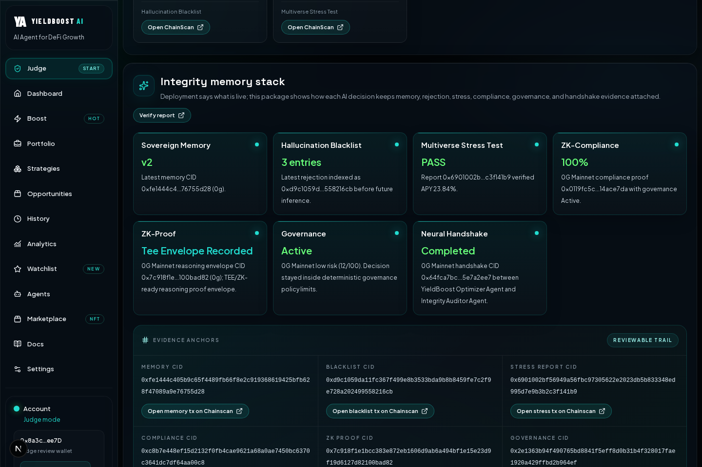
</p>

<p align="center"><em>The main proof path shows the 9-layer stack operating together: blacklist, auditor, TEE, sovereign memory, 0G storage, ZK proof, ProofRegistry anchor, governance, and cross-agent handshake.</em></p>

### Mainnet Contract and Proof Evidence

| Artifact | Value |
| --- | --- |
| Mainnet `ProofRegistry` | [`0x8e63e117E71A80Cfc10fDF375F079e2e29cd7D7D`](https://chainscan.0g.ai/address/0x8e63e117E71A80Cfc10fDF375F079e2e29cd7D7D) |
| Mainnet `YieldStrategyINFT` | [`0xb264D861264B0e4f8fb98A61B7694BA8a3B6BBe3`](https://chainscan.0g.ai/address/0xb264D861264B0e4f8fb98A61B7694BA8a3B6BBe3) |
| Mainnet attestation oracle | [`0x216E7880D64D94335B583c539802d3e61958d4A2`](https://chainscan.0g.ai/address/0x216E7880D64D94335B583c539802d3e61958d4A2) |
| Mainnet strategy marketplace | [`0x48F989C7f41056509980731C1b4D59164C0C1A40`](https://chainscan.0g.ai/address/0x48F989C7f41056509980731C1b4D59164C0C1A40) |
| Mainnet `GlobalBlacklistRegistry` | [`0xbc576EA5a68ED9d217299c107C801445e9A5a7BE`](https://chainscan.0g.ai/address/0xbc576EA5a68ED9d217299c107C801445e9A5a7BE) |
| Mainnet `ValidationRegistry` | [`0x62aa83b0A610BE298dF08004d764229B8f2aC219`](https://chainscan.0g.ai/address/0x62aa83b0A610BE298dF08004d764229B8f2aC219) |
| Latest proof CID | `0x34591917c809c3c0d00a7c9134b9c7f48bb0be4befba9f59c355499c96fd0b58` |
| Latest 0G Storage tx | [`0xbd25bad750df808237525b9f5f84200b10bcbbf1cc1b8687c071b291e331a121`](https://chainscan.0g.ai/tx/0xbd25bad750df808237525b9f5f84200b10bcbbf1cc1b8687c071b291e331a121) |
| Latest `ProofRegistry` anchor tx | [`0x11ca104543d7c6705b4f14d336a2581aa69bfdb819a5c76b7f6e1f71b29eb823`](https://chainscan.0g.ai/tx/0x11ca104543d7c6705b4f14d336a2581aa69bfdb819a5c76b7f6e1f71b29eb823) |
| Latest `ProofRegistry` proof ID | `36` |
| Latest TEE model + provider | `openai/gpt-5.4-mini` via `0x25F8f01cA76060ea40895472b1b79f76613Ca497` |
| Latest ZK `agent_identity` proof digest | `0xe3dda0d378f18d3f47024fb47cd129b82956c9fffe3e6b76e8940608b7c668d8` |
| Latest Agent NFT | `Token #5` |
| Latest Agent NFT mint tx | [`0xb113f436944ebb8c50a2b432818673059ddd8f69a497b7fd80407047e8fb1e67`](https://chainscan.0g.ai/tx/0xb113f436944ebb8c50a2b432818673059ddd8f69a497b7fd80407047e8fb1e67) |

### Latest Integrity Stack Evidence

These mainnet artifacts prove the newly added agent memory, blacklist, and stress-test layers are operational in the same codebase:

| Artifact | CID / tx |
| --- | --- |
| Sovereign Memory CID | `0x49d2577755db2f4300ba490c9c825dc0cc1b6d56b97c2f7d589307c31c4770f4` |
| Sovereign Memory tx | [`0x2c30318e259de1e8abbddc338107a89401200b03a2fa450cd990661e08e69939`](https://chainscan.0g.ai/tx/0x2c30318e259de1e8abbddc338107a89401200b03a2fa450cd990661e08e69939) |
| Hallucination Blacklist CID | `0xd660cdb9aec29214736fcb5763ba80fe6a5d2dcfd6cc35d68d7a178372b21625` |
| Hallucination Blacklist tx | [`0x4eaee2337e0ffbec64b43e85c4619768071a0ff11c6a0b6c7a6c65a6a4521cb3`](https://chainscan.0g.ai/tx/0x4eaee2337e0ffbec64b43e85c4619768071a0ff11c6a0b6c7a6c65a6a4521cb3) |
| Multiverse Stress Report CID | `0x6901002bf56949a56fbc97305622e2023db5b833348ed995d7e9b3b2c3f141b9` |
| Multiverse Stress Report tx | [`0xe76ff5180612b78c6a153b2fc323fbb064237a9050cd20aedb7fbeddb1aa410c`](https://chainscan.0g.ai/tx/0xe76ff5180612b78c6a153b2fc323fbb064237a9050cd20aedb7fbeddb1aa410c) |

What this means in practice:

- `mainnet` is the default review path in the live app.
- `/judge` can still switch between mainnet and testnet when a reviewer wants comparison context.
- testnet remains available for iteration and fallback, but it is no longer the primary submission narrative.
- the same live stack also exposes a mainnet `YieldStrategyINFT` contract for strategy-agent minting.

### Additional Control Plane Evidence

These newer artifacts extend the original integrity stack without replacing it. They document how reasoning, governance, and agent-to-agent coordination are now persisted as first-class backend outputs:

| Artifact | CID / tx |
| --- | --- |
| Zero-Knowledge Proof Layer CID | `0xe84d0aed1bd1a023ebfa80f75397c1d03f047e4ecd0a90b7b9d729d1b18aaedf` |
| Zero-Knowledge Proof Layer storage tx | [`0x1039013ad1403ac6d9f69525a9862e4cfab987e0808f53e452dabcaec5c450f2`](https://chainscan.0g.ai/tx/0x1039013ad1403ac6d9f69525a9862e4cfab987e0808f53e452dabcaec5c450f2) |
| Zero-Knowledge Proof Layer `ProofRegistry` anchor tx | [`0xfc5e71ae4467c4564481556e184c925865d61b2942abace27228e0d285123cdd`](https://chainscan.0g.ai/tx/0xfc5e71ae4467c4564481556e184c925865d61b2942abace27228e0d285123cdd) |
| Governance artifact CID | `0x3ccf7e94cf5e929035c2f05b26075f68d47dc24069c01c514364168caca4708c` |
| Governance tx | [`0xa3e4d93c997f1e76747e1787f769c2b1e26351752f5ee48311a02857c4c4e7f3`](https://chainscan.0g.ai/tx/0xa3e4d93c997f1e76747e1787f769c2b1e26351752f5ee48311a02857c4c4e7f3) |
| Cross-Agent Neural Handshake CID | `0xd1b41c5cca8504b242e55c4c7e032aee69debef5fabe887f759d427c423963d3` |
| Cross-Agent Neural Handshake tx | [`0x499a6f73c7b9ce0b7f7312713be8daf1dd3324a46129f946cec7d4fb8397a694`](https://chainscan.0g.ai/tx/0x499a6f73c7b9ce0b7f7312713be8daf1dd3324a46129f946cec7d4fb8397a694) |
| ZK Policy Seal CID | `0x34591917c809c3c0d00a7c9134b9c7f48bb0be4befba9f59c355499c96fd0b58` |
| ZK Policy Seal tx | [`0xbd25bad750df808237525b9f5f84200b10bcbbf1cc1b8687c071b291e331a121`](https://chainscan.0g.ai/tx/0xbd25bad750df808237525b9f5f84200b10bcbbf1cc1b8687c071b291e331a121) |
| ZK Policy Seal `ProofRegistry` anchor tx | [`0x11ca104543d7c6705b4f14d336a2581aa69bfdb819a5c76b7f6e1f71b29eb823`](https://chainscan.0g.ai/tx/0x11ca104543d7c6705b4f14d336a2581aa69bfdb819a5c76b7f6e1f71b29eb823) |

### Zero-Knowledge Proof Layer, Programmable Governance, and Cross-Agent Neural Handshake

The newest control-plane features now surface real mainnet artifacts instead of UI placeholders:

- **Zero-Knowledge Proof Layer** records a live reasoning-proof envelope to 0G Storage and anchors it on-chain. Current mainnet status: `tee-envelope-recorded`.
- **Programmable AI Governance** evaluates the latest strategy output against deterministic risk rules and can return `active`, `warning`, `throttled`, or `halted`. Current mainnet status: `active` with low risk `12/100`.
- **Cross-Agent Neural Handshake** stores an optimizer-to-auditor coordination transcript so the reasoning handoff is externally inspectable. Current mainnet status: `completed`.
- **ZK Policy Seal** proves that the last execution stayed `100%` inside the active governance policy and is currently sealed into the same latest proof artifact shown on `/judge`.

## Why This Matters

Most DeFi dashboards can claim "AI". Very few make the output easy to audit.

YieldBoost AI is designed around a practical Web3 problem: users often hold crypto balances that are too small, forgotten, or operationally awkward to manage manually. Those idle balances create opportunity cost.

YieldBoost turns that idle capital into an actionable, proof-backed yield route:

- It reads the wallet snapshot and identifies underused balance exposure.
- It recommends a higher-yield route such as LP, staking, or safer rebalance opportunities based on the active strategy model.
- It runs the prediction through a deterministic Integrity Auditor before treating it as proof-ready.
- It stores the optimization output as a verifiable artifact instead of leaving it as a temporary UI suggestion.

The project is also designed around **verifiable AI**, not just recommendation UX:

- The optimization result is serialized and uploaded through the 0G mainnet storage pipeline by default.
- The Integrity Auditor compares that result with the live/proof-backed wallet snapshot and rejects impossible yield claims before storage or minting.
- The latest run is retained in a runtime proof ledger.
- The storage result is also anchored on-chain through `ProofRegistry`.
- The judge can open `/judge` first, inspect the latest wallet snapshot in read-only mode, and switch networks only if they want secondary context.

That combination is the project's strongest differentiator for a hackathon review setting.

## Hackathon Track Alignment

YieldBoost AI spans four 0G hackathon tracks because it is not a single-purpose DApp. It is a full-stack agentic ecosystem where one native 9-layer security core powers agent infrastructure, verifiable trading, developer-facing API commerce, and sovereign privacy.

The mapping is direct: the same repo that runs 1-click optimize also exposes the proof ledger, vault, developer API store, anti-sybil faucet, Strategy Agent NFT layer, and partner SDK wrapper surface. The 1-click optimizer is the clearest live demo because one run touches the agent infrastructure path, the verifiable trading path, and the sovereign privacy path at the same time.

### Track 1: Agentic Infrastructure & OpenClaw Lab

**Track need:** cognitive backbone, orchestration, state persistence, data pipelines, and agent memory.

**Repo infrastructure:**

- **0G Compute path** through [`lib/server/og-compute.ts`](lib/server/og-compute.ts) for broker-aware inference and TEE response evidence.
- **1-click optimize** is the first consumer of that infrastructure: it orchestrates prompt compression, blacklist checks, semantic cache, compute, storage, registry anchoring, memory sync, governance, ZK evidence, and cross-agent handoff in one user action.
- **Sovereign Memory** through [`app/api/agent/memory`](app/api/agent/memory/route.ts), storing agent state snapshots as 0G-backed memory artifacts.
- **Runtime proof ledger** through [`lib/server/runtime-store.ts`](lib/server/runtime-store.ts), allowing agents, judges, and API surfaces to rehydrate prior decisions.
- **Prompt compression, semantic cache, and blacklist pre-checks** before inference, giving the agent a real orchestration path instead of raw prompt forwarding.
- **Layer-as-a-service endpoints** in the developer marketplace, so the 9-layer stack can be called by external agent apps.

This makes YieldBoost an agent infrastructure layer first: it gives autonomous finance agents memory, verification, state persistence, and reusable security modules.

### Track 2: Agentic Trading Arena (Verifiable Finance)

**Track need:** intelligent yield optimizers, risk-management bots, verifiable finance, sealed inference, TEE-based execution, and protection from front-running.

**Repo infrastructure:**

- **1-click optimize** is the trading entry point: it reads wallet state, computes a low-risk yield route, and produces a proof-backed recommendation.
- **Native 9-layer military-grade stack** is the trading safety core:
  Hallucination Blacklist, Integrity Auditor, Secure Compute / TEE, Sovereign Memory, 0G Storage Proof Layer, Zero-Knowledge Proof Layer, ProofRegistry Anchor, Programmable Governance, and Cross-Agent Neural Handshake.
- **Secure Compute / TEE evidence** protects the execution path and supports sealed-inference style privacy for proprietary strategy logic.
- **0G Storage + ProofRegistry** turn every approved optimization into an externally reviewable finance artifact.
- **Strategy Agent NFTs** through `YieldStrategyINFT` promote verified strategies into portable on-chain agent assets.

Track 2 is where the core product lands hardest: YieldBoost is not just recommending APY, it is proving why an agentic trading decision should be trusted. The same 1-click run also supplies Track 1 evidence through orchestration and state persistence, and Track 5 evidence through TEE, sovereign memory, ZK envelopes, and proof anchoring.

### Track 3: Agentic Economy & Autonomous Applications

**Track need:** AI-native marketplaces, Agent-as-a-Service platforms, automated billing, micropayments, and revenue rails for autonomous apps.

**Repo infrastructure:**

- **Developer API Store & Marketplace** at [`/marketplace`](https://dev.yieldboostai.xyz/marketplace), exposing the full 9-layer API, individual layer APIs, and partner SDK wrappers.
- **Anti-sybil + ZK + Alibaba module** in the marketplace proves the stack can be sold as a reusable security product, not only as one internal app path.
- **Anti-sybil faucet** at [`/faucet`](https://yieldboostai.xyz/faucet), giving the public a claim-flow example for testing access logic and abuse resistance before teams move into the mainnet marketplace.
- **API key playground and package tiers** connect developer usage, subscription intent, and security-layer access.
- **Partner SDK wrapper model** proves that external agent services can be wrapped and sold through the same security envelope.
- **VeilSolver Secure Proxy** is the live partner example: a third-party solver is exposed through YieldBoost isolated execution, ZK envelope, and 0G anchor semantics.

Track 3 is the business surface: YieldBoost turns agent security into something other builders can subscribe to, test, and integrate.

### Track 5: Privacy & Sovereign Infrastructure

**Track need:** confidentiality rails, MEV-resistant infrastructure, privacy-preserving protocols, secure execution, and sovereign agent state.

**Repo infrastructure:**

- **Native 9-layer military-grade stack** is the core privacy and sovereignty system, not an add-on.
- **1-click optimize** is the live Track 5 surface: the optimizer does not only produce APY output; it routes the decision through Secure Compute / TEE, Sovereign Memory, Zero-Knowledge Proof Layer, ProofRegistry Anchor, and Cross-Agent Neural Handshake.
- **Secure Compute / TEE** protects sensitive strategy execution and records response evidence.
- **Vault sealing** through [`/vault`](https://yieldboostai.xyz/vault) gives users wallet-scoped private records with separated user tx, storage tx, and proof tx visibility.
- **Sovereign Memory** persists agent state without reducing the strategy to a temporary browser session.
- **Zero-Knowledge Proof Layer** creates reviewable proof envelopes for reasoning and policy evidence.
- **Partner SDK wrapper architecture** shows how YieldBoost can secure third-party systems like VeilSolver without making that partner the source of the core 9-layer stack.

Track 5 is where the 9-layer stack becomes the moat: private execution, memory, ZK evidence, and partner wrapping all share one sovereign verification core. `/vault` strengthens the privacy story, but the core Track 5 claim already lives inside the main 1-click optimizer path.

The clearest submission sentence is: **YieldBoost AI is a full-stack agentic ecosystem on 0G: Track 1 infrastructure, Track 2 verifiable trading, Track 3 autonomous API economy, and Track 5 sovereign privacy, all powered by one native 9-layer military-grade stack.**

## Showcase

<table>
  <tr>
    <td width="50%">
      
    </td>
    <td width="50%">
      
    </td>
  </tr>
  <tr>
    <td align="center"><strong>Dashboard</strong><br />Portfolio intelligence, proof-aware UX, and optimization entry point.</td>
    <td align="center"><strong>Judge Mode</strong><br />Read-only audit route with latest proof, wallet snapshot, and verification links.</td>
  </tr>
  <tr>
    <td width="50%">
      
    </td>
    <td width="50%">
      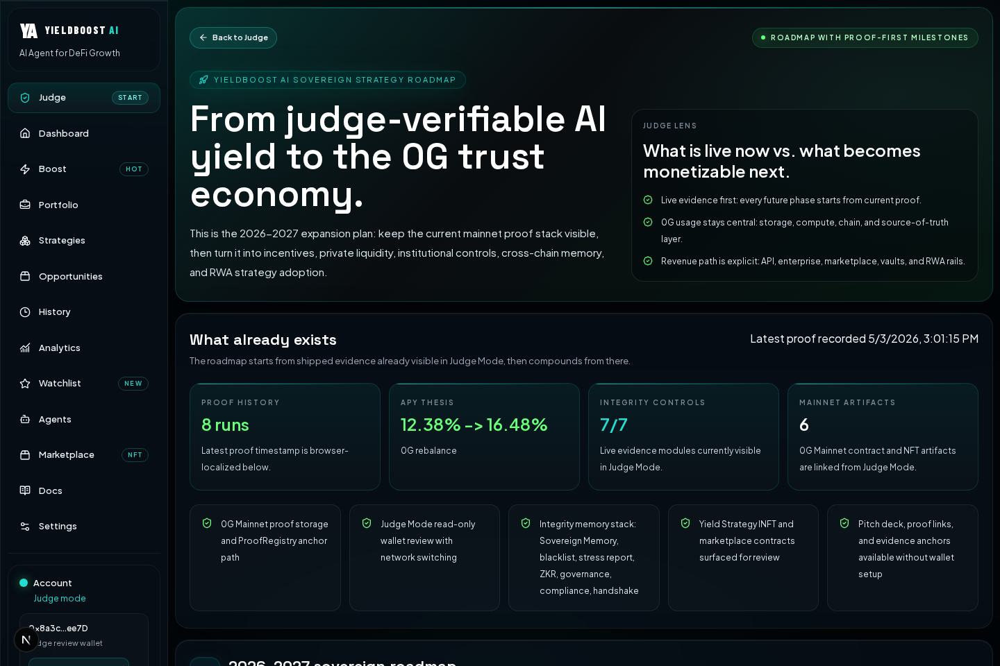
    </td>
  </tr>
  <tr>
    <td align="center"><strong>Integrity Stack</strong><br />Zero-Knowledge Proof Layer, Programmable Governance, Cross-Agent Neural Handshake, policy seal, memory, blacklist, and stress evidence in one judge-readable package.</td>
    <td align="center"><strong>Sovereign Roadmap</strong><br />What already exists, how 0G stays central, and how the protocol expands into revenue-grade trust infrastructure.</td>
  </tr>
</table>

## Fast Judge Review

| Step | What the judge sees | Why it matters |
| --- | --- | --- |
| 1 | Open `/judge` | Starts directly on the audit-first route instead of a wallet setup screen. |
| 2 | Review latest proof snapshot | Shows route recommendation, APY lift, wallet snapshot, and reasoning in one place. |
| 3 | Open explorer links | Lets the judge inspect the latest 0G mainnet storage tx and ProofRegistry anchor directly. |
| 4 | Inspect Integrity memory stack | Shows Zero-Knowledge Proof Layer, Programmable Governance, and Cross-Agent Neural Handshake evidence together with their anchors. |
| 5 | Open `Roadmap` beside the pitch/PDF links | Frames what is already live, what becomes monetizable next, and why 0G remains the execution and verification base layer. |
| 6 | Navigate deeper only if needed | `/history`, `/agents`, and `/marketplace` remain available without breaking the review flow. |

## Architecture

The architecture is split so judges can understand it fast:

1. **Mainnet production spine**: 1-click optimize, proof storage, ZK layer, ProofRegistry, judge review, and the developer marketplace.
2. **Testnet public testing surfaces**: vault and the anti-sybil airdrop example, where large numbers of external testers can interact without forcing everyone to spend mainnet gas.
3. **Shared security design**: anti-sybil checks, Alibaba fingerprinting, ZK packaging, governance, and memory all come from the same broader YieldBoost verification model, even when the public surface is not on the same network.

### Mainnet Production Surfaces

- **1-click optimize** is the shortest live proof of the product.
- **Judge mode** is the wallet-free audit route.
- **Developer marketplace** is where the stack becomes revenue: modular APIs, SDK wrappers, and the anti-sybil + ZK + Alibaba fingerprinting module.
- **Mainnet contracts and proof anchors** make the core path externally reviewable.

### Testnet Challenge and Public Example Surfaces

- **Vault** stays testnet because it is designed to attract attackers, retries, and repeated public challenge attempts.
- **Faucet** stays testnet because airdrop-style anti-sybil tuning benefits from many testers without burdening them with mainnet cost.
- **Why this is honest:** these surfaces are labeled testnet in the product and should be read as challenge/example environments, not as the main submission backbone.

### Core Flows

### Core Optimizer, TEE, and ZK Proof Flow

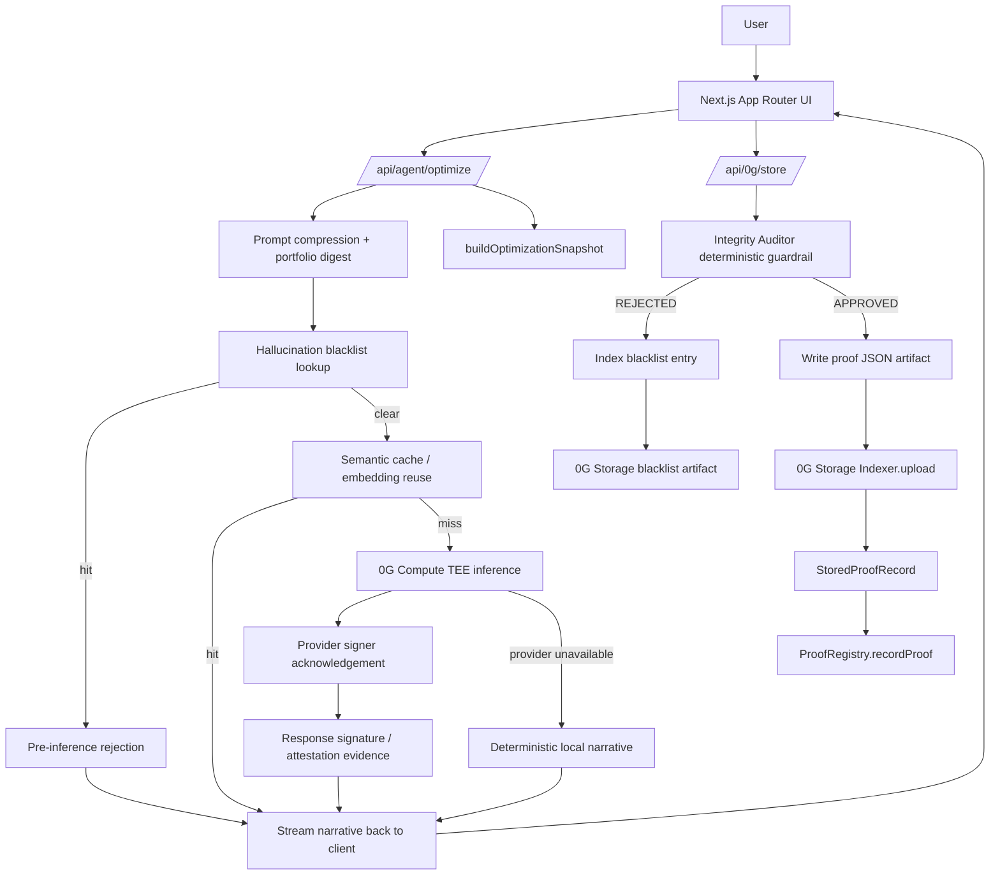

### Nine-Layer Evidence Pipeline

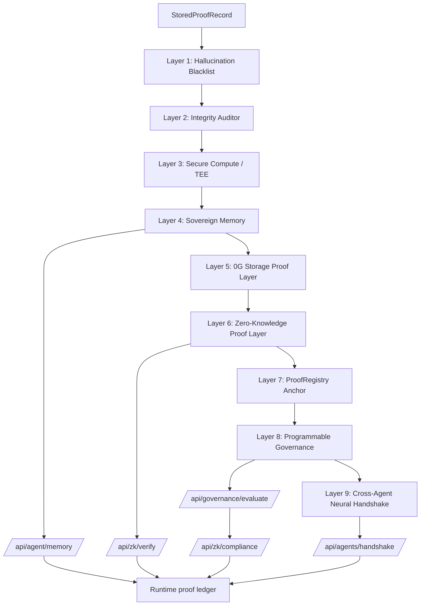

### Judge Review Flow

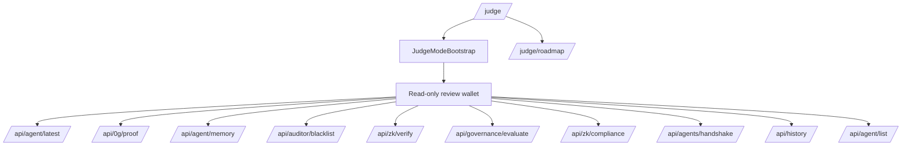

### Vault Challenge Flow

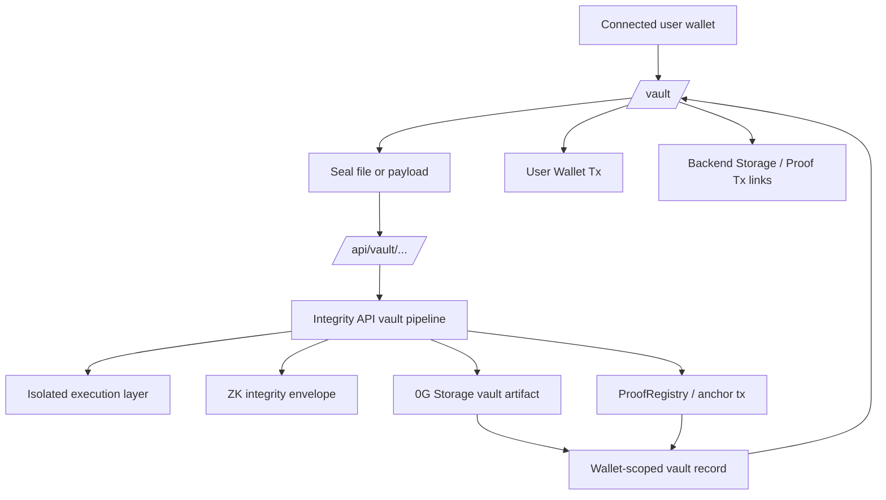

### Anti-Sybil Airdrop Example and Developer Access Flow

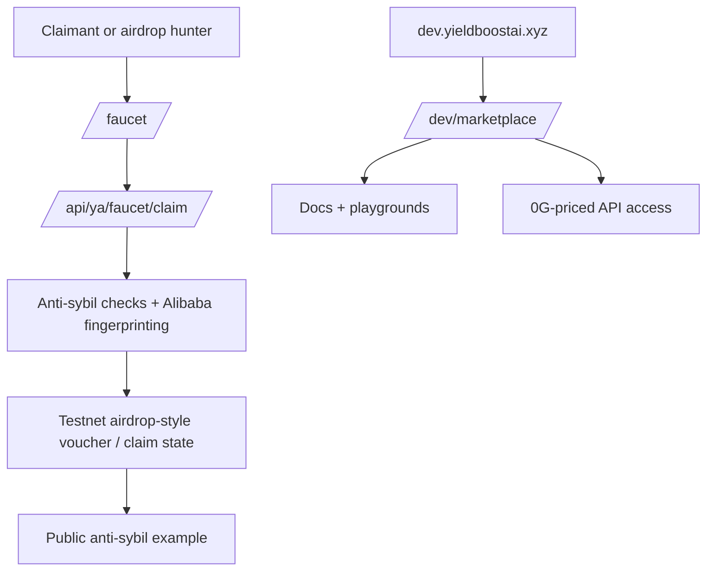

### Developer API Store and Partner Wrapper Flow

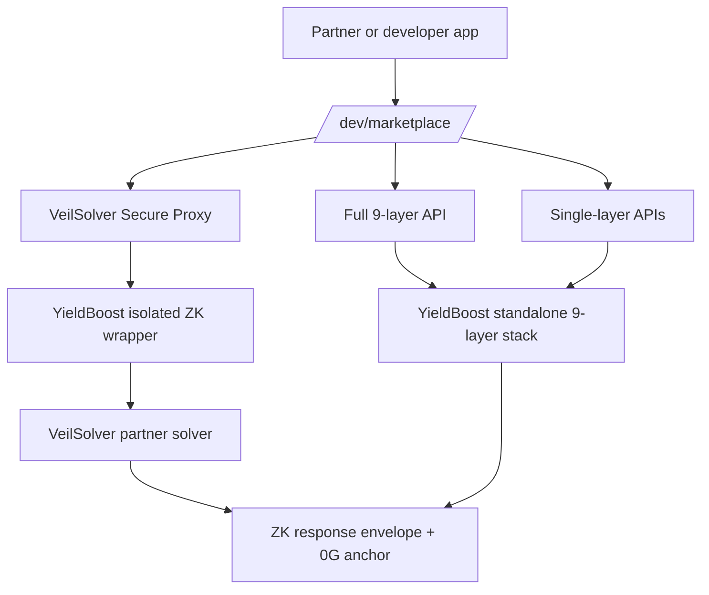

### Stress Replay Flow

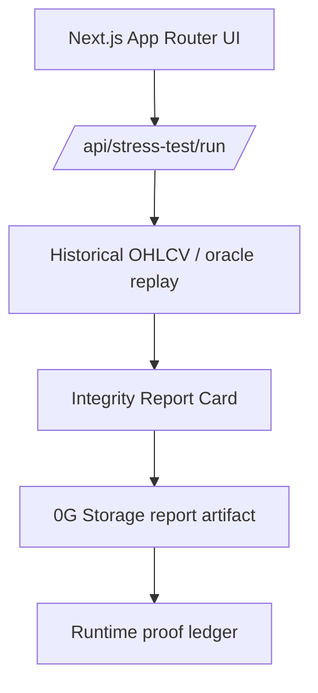

### Runtime Rehydration Flow

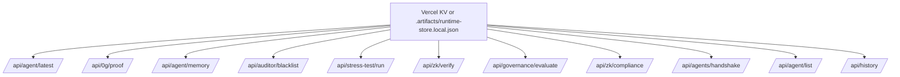

## 0G-Native Data Flow

1. The client calls [`/api/agent/optimize`](app/api/agent/optimize/route.ts), which compresses the prompt, hashes the wallet scope, and builds a deterministic optimization snapshot.
2. Before inference, the optimizer checks the **Hallucination Blacklist** in [`lib/server/hallucination-blacklist.ts`](lib/server/hallucination-blacklist.ts). Similar rejected patterns return a pre-inference block instead of spending compute.
3. If no blacklist match is found, the optimizer checks exact cache and embedding-based semantic cache through [`lib/server/optimization-cache.ts`](lib/server/optimization-cache.ts).
4. If no cache is available, the app attempts **0G Compute TEE** inference through [`lib/server/og-compute.ts`](lib/server/og-compute.ts), including provider signer acknowledgement and response signature / attestation evidence when the provider returns it.
5. The client posts the finalized decision payload to [`/api/0g/store`](app/api/0g/store/route.ts).
6. The storage route runs the deterministic Integrity Auditor from [`lib/integrity-audit.ts`](lib/integrity-audit.ts), comparing the worker prediction against the submitted wallet snapshot and the latest runtime proof reference when available.
7. If the audit is `REJECTED`, the route indexes the failed input/output/reasoning into the Hallucination Blacklist and skips ProofRegistry promotion.
8. If the audit is `APPROVED`, the route writes a JSON proof artifact, uploads it through **0G Storage** using `Indexer.upload`, and records the resulting storage hash and tx metadata.
9. If `ProofRegistry` is configured, the same route calls `recordProof(...)` on the on-chain registry contract defined in [`contracts/ProofRegistry.sol`](contracts/ProofRegistry.sol).
10. After a successful proof write, [`lib/server/sovereign-memory.ts`](lib/server/sovereign-memory.ts) syncs the agent's latest context snapshot to 0G Storage and records the memory CID.
11. [`/api/zk/verify`](app/api/zk/verify/route.ts) can persist a **Zero-Knowledge Proof Layer** envelope for the decision narrative, public signals, verifier identity, and portfolio snapshot.
12. [`/api/governance/evaluate`](app/api/governance/evaluate/route.ts) evaluates the strategy against programmable risk policy and records whether the strategy remains `active`, `warning`, `throttled`, or `halted`.
13. [`/api/agents/handshake`](app/api/agents/handshake/route.ts) records the optimizer-to-auditor **Cross-Agent Neural Handshake** transcript digest so the reasoning handoff is inspectable.
14. [`/api/zk/compliance`](app/api/zk/compliance/route.ts) ties governance and the latest stored proof into a deterministic policy seal artifact.
15. [`/api/stress-test/run`](app/api/stress-test/run/route.ts) can replay historical OHLCV/oracle slices, produce an Integrity Report Card, and store that report on 0G Storage.
16. The full proof, Noir Sentinel identity status, TEE response metadata, memory, blacklist, stress-test, ZKR, governance, policy seal, and handshake records are persisted into the runtime ledger managed by [`lib/server/runtime-store.ts`](lib/server/runtime-store.ts), backed by **Vercel KV** when available or `.artifacts/runtime-store.local.json` as a local fallback.
17. The proof can then be rehydrated across the product through:
   - [`/api/agent/latest`](app/api/agent/latest/route.ts)
   - [`/api/0g/proof`](app/api/0g/proof/route.ts)
   - [`/api/agent/memory`](app/api/agent/memory/route.ts)
   - [`/api/auditor/blacklist`](app/api/auditor/blacklist/route.ts)
   - [`/api/stress-test/run`](app/api/stress-test/run/route.ts)
   - [`/api/zk/verify`](app/api/zk/verify/route.ts)
   - [`/api/governance/evaluate`](app/api/governance/evaluate/route.ts)
   - [`/api/zk/compliance`](app/api/zk/compliance/route.ts)
   - [`/api/agents/handshake`](app/api/agents/handshake/route.ts)
   - [`/api/history`](app/api/history/route.ts)
   - [`/api/agent/list`](app/api/agent/list/route.ts)
18. The judge opens [`/judge`](<app/(workspace)/judge/page.tsx>), which surfaces the latest proof, wallet snapshot, memory CID, blacklist CID, stress-test report CID, ZKR CID, governance CID, handshake CID, explorer links, registry status, and Integrity Auditor state in one audit-first page.
19. If a reviewer wants the business expansion path, [`/judge/roadmap`](<app/(workspace)/judge/roadmap/page.tsx>) keeps the roadmap adjacent to the pitch deck and PDF links without adding sidebar clutter.

## 0G Integration Upgrade

The repo includes the original integrity memory stack plus three newer control-plane additions: **Zero-Knowledge Proof Layer**, **Programmable Governance**, and **Cross-Agent Neural Handshake**.

| Layer | Backend path | Storage artifact | Contract path |
| --- | --- | --- | --- |
| Sovereign Memory | [`/api/agent/memory`](app/api/agent/memory/route.ts), [`lib/server/sovereign-memory.ts`](lib/server/sovereign-memory.ts) | Agent context snapshot JSON on 0G Storage | `agentMemory[tokenId]` in [`YieldStrategyINFT.sol`](contracts/YieldStrategyINFT.sol) |
| Hallucination Blacklist | [`/api/auditor/blacklist`](app/api/auditor/blacklist/route.ts), [`lib/server/hallucination-blacklist.ts`](lib/server/hallucination-blacklist.ts) | Invalid input + hallucinated output + auditor reasoning | [`GlobalBlacklistRegistry.sol`](contracts/GlobalBlacklistRegistry.sol) |
| Multiverse Stress Test | [`/api/stress-test/run`](app/api/stress-test/run/route.ts), [`lib/server/multiverse-stress-test.ts`](lib/server/multiverse-stress-test.ts) | Integrity Report Card from historical replay | [`ValidationRegistry.sol`](contracts/ValidationRegistry.sol) |
| Zero-Knowledge Proof Layer | [`/api/zk/verify`](app/api/zk/verify/route.ts), [`lib/server/zk-reasoning.ts`](lib/server/zk-reasoning.ts) | Live TEE/ZK reasoning envelope with public signals and verifier context | Anchored through 0G storage tx metadata and surfaced in Judge Mode |
| Programmable AI Governance | [`/api/governance/evaluate`](app/api/governance/evaluate/route.ts), [`lib/server/ai-governance.ts`](lib/server/ai-governance.ts) | Deterministic policy decision with risk score, kill switch, and status | Designed to gate future guardian / strategy governance flows |
| Cross-Agent Neural Handshake | [`/api/agents/handshake`](app/api/agents/handshake/route.ts), [`lib/server/cross-agent-handshake.ts`](lib/server/cross-agent-handshake.ts) | Optimizer-to-auditor transcript digest and coordination envelope | Anchored as an inspectable 0G artifact before downstream review |

### Sovereign Memory

The agent persists a compact state snapshot after successful proof cycles. The snapshot includes context summary, recent task, latest recommendation, auditor status, proof CID, memory version, and optional token ID. This gives Strategy Agent NFTs a portable memory pointer instead of leaving agent history trapped in a browser session.

### Hallucination Blacklist

Rejected auditor outputs are no longer dead ends. They are transformed into blacklist entries with a fingerprint, invalid input document, hallucinated output, auditor reasoning, score, CID, and optional explorer URL. Future optimizer calls check this list before inference, so known-bad requests can be rejected before 0G Compute or fallback generation runs.

### Multiverse Stress Test

The stress-test runner replays historical OHLCV/oracle slices against standard agent decisions and audited decisions. The output is an Integrity Report Card containing decision-by-decision verdicts, verified APY, simulated profit, max drawdown, and final verdict. The report is stored as a 0G Storage artifact and surfaced in Judge Mode.

## Agent NFT Layer

YieldBoost AI is not only storing optimization proofs. It also turns a completed proof-backed strategy into a **Strategy Agent NFT** on 0G mainnet.

- [`contracts/YieldStrategyINFT.sol`](contracts/YieldStrategyINFT.sol) is the on-chain contract for the strategy NFT layer.
- [`/api/agent/mint`](app/api/agent/mint/route.ts) mints the NFT from a live optimization result, using the connected wallet as the NFT recipient.
- [`contracts/AttestationRegistryOracle.sol`](contracts/AttestationRegistryOracle.sol) now backs the optional on-chain attestation path so broker-verified compute hashes can be registered before minting.
- [`/marketplace`](<app/(workspace)/marketplace/page.tsx>) adds a simple Strategy NFT marketplace gallery for browsing minted strategies by APY, ROI lift, accuracy, owner, and proof link.
- [`contracts/YieldStrategyAdoptionMarket.sol`](contracts/YieldStrategyAdoptionMarket.sol) provides the adoption contract path for listing and adopting enumerable Strategy NFTs.
- [`/api/agent/list`](app/api/agent/list/route.ts) reads back minted strategy agents from the contract, with a graceful proof-history fallback when contract mode is unavailable.
- The NFT payload carries the optimization context: APY delta, ROI lift, strategy accuracy/confidence, strategy reasoning, proof hash references, and attestation-linked metadata.

Why this matters for judging:

- it shows YieldBoost AI is not only a dashboard, but also an **agent identity / strategy ownership layer**
- it aligns the product with 0G's broader direction around **Agent ID-style composable intelligence**
- it gives the project a second verifiable asset surface beyond storage proofs and registry anchors

## What Is Actually Live In This Repo

### Verifiable AI Pipeline

- **0G Compute-first inference path**: the live optimize route uses the 0G broker path for verified inference evidence and surfaces the compute status clearly in Judge Mode.
- **0G Storage proof persistence**: every successful proof write stores decision metadata, timestamps, wallet scope, and explorer links.
- **Integrity Auditor guardrail**: before a proof is stored or a strategy can be promoted, a deterministic rule-based backend auditor checks APY bounds, lift sanity, snapshot presence, route/asset compatibility, and zero-balance hallucination cases.
- **Zero-Knowledge Proof Layer, Programmable Governance, and Cross-Agent Neural Handshake artifacts**: the latest control-plane additions store reasoning envelopes, deterministic policy outcomes, and optimizer-to-auditor transcript digests as 0G-backed evidence.
- **Optional on-chain ProofRegistry anchoring**: if the registry contract env is present, the proof is also recorded on-chain and surfaced with a registry tx hash and proof id.
- **Runtime proof ledger**: proofs are queryable later without re-running the optimization.

### Frictionless Judge Experience

- **`/judge` is the intended submission entry point** and defaults to the current mainnet review path.
- **No wallet connection is required** for review.
- **No faucet step is required** for the judge to inspect the latest recorded result.
- **Read-only mode is explicit**: `JudgeModeBootstrap` sets judge mode state, scopes the session to the review wallet, and keeps the main flow non-destructive.
- **Mainnet is the default review network** while testnet stays available as secondary context from the same page.

### Agent / INFT Extension Path

- [`contracts/YieldStrategyINFT.sol`](contracts/YieldStrategyINFT.sol) defines the Strategy Agent NFT contract.
- [`/api/agent/mint`](app/api/agent/mint/route.ts) can mint a strategy NFT using a stored strategy payload, a content hash, APY in basis points, and an attestation hash.
- [`/api/agent/list`](app/api/agent/list/route.ts) reads live contract data when the INFT contract is configured.
- If the contract path is not configured, the gallery degrades gracefully to **proof-backed runtime history** instead of failing.

## Judge Mode Highlight

`/judge` is not a cosmetic dashboard variant. It is a purpose-built audit surface for hackathon evaluation.

It does six important things:

- **Bootstraps a review wallet automatically** when no wallet is connected.
- **Pins the review flow to the latest recorded proof**, so judges see a concrete result first.
- **Defaults the review path to mainnet**, which matches the current live submission story.
- **Keeps proof links, CID/root hash, registry status, and snapshot details on one page**, minimizing review friction.
- **Shows the Integrity Auditor result** so reviewers can see whether the deterministic guardrail approved the prediction before proof persistence.
- **Groups Zero-Knowledge Proof Layer, Programmable Governance, and Cross-Agent Neural Handshake evidence together**, so reviewers can see the reasoning control plane instead of hunting through API responses.

This is the UX decision that makes YieldBoost AI unusually judge-friendly: the verification path is short, visible, and does not depend on extension setup.

<p align="center">
  
</p>

<p align="center"><em>Proof modal showing the storage-backed verification layer exposed to the reviewer.</em></p>

## Technical Notes That Matter

### 0G Components Used

| 0G primitive | Where it appears | What it does |
| --- | --- | --- |
| 0G Compute | [`lib/server/og-compute.ts`](lib/server/og-compute.ts) | Initializes the broker, funds the inference sub-account when needed, acknowledges provider signer, and performs inference requests. |
| 0G Storage | [`app/api/0g/store/route.ts`](app/api/0g/store/route.ts), [`lib/server/zero-g-storage.ts`](lib/server/zero-g-storage.ts) | Uploads proof payloads, memory snapshots, blacklist entries, and stress-test reports through the 0G SDK indexer. |
| ProofRegistry | [`contracts/ProofRegistry.sol`](contracts/ProofRegistry.sol) and [`app/api/0g/store/route.ts`](app/api/0g/store/route.ts) | Anchors proof metadata on-chain and emits `ProofRecorded`. |
| Sovereign Memory | [`app/api/agent/memory/route.ts`](app/api/agent/memory/route.ts) and [`contracts/YieldStrategyINFT.sol`](contracts/YieldStrategyINFT.sol) | Stores agent state snapshots on 0G Storage and exposes `agentMemory[tokenId]`. |
| Hallucination Blacklist | [`app/api/auditor/blacklist/route.ts`](app/api/auditor/blacklist/route.ts) and [`contracts/GlobalBlacklistRegistry.sol`](contracts/GlobalBlacklistRegistry.sol) | Indexes rejected auditor outputs and checks similar requests before inference. |
| Multiverse Stress Test | [`app/api/stress-test/run/route.ts`](app/api/stress-test/run/route.ts) and [`contracts/ValidationRegistry.sol`](contracts/ValidationRegistry.sol) | Replays historical slices and stores Integrity Report Cards as 0G artifacts. |
| Zero-Knowledge Proof Layer | [`app/api/zk/verify/route.ts`](app/api/zk/verify/route.ts) and [`lib/server/zk-reasoning.ts`](lib/server/zk-reasoning.ts) | Persists live TEE/ZK reasoning envelopes with public signals and verifier context. |
| Programmable AI Governance | [`app/api/governance/evaluate/route.ts`](app/api/governance/evaluate/route.ts) and [`lib/server/ai-governance.ts`](lib/server/ai-governance.ts) | Applies deterministic policy status, risk scoring, and kill-switch semantics before downstream reliance. |
| Cross-Agent Neural Handshake | [`app/api/agents/handshake/route.ts`](app/api/agents/handshake/route.ts) and [`lib/server/cross-agent-handshake.ts`](lib/server/cross-agent-handshake.ts) | Records optimizer-to-auditor coordination transcripts as inspectable 0G artifacts. |

### Token / Prompt Efficiency

The active runtime now includes a real efficiency stack, not just short prompts:

- **Dedicated prompt compression** in [`lib/server/prompt-compression.ts`](lib/server/prompt-compression.ts):
  - normalizes noisy user prompts
  - summarizes the live portfolio into a compact holdings string
  - rewrites the request into a stable intent-and-constraint format before inference
- **Semantic cache keys** in [`lib/server/optimization-cache.ts`](lib/server/optimization-cache.ts):
  - wallet-aware
  - network-aware
  - prompt-aware
  - portfolio-aware
- **Embedding-based prompt reuse** via Alibaba DashScope `text-embedding-v4` in [`lib/server/alibaba-embeddings.ts`](lib/server/alibaba-embeddings.ts), with similarity matching against recent cached optimization requests for the same wallet/network/asset signature
- The 0G Compute system instruction still forces a **short response under 60 words**
- The inference request still uses **`temperature: 0.2`** and **`max_tokens: 512`**

In practice, the route now tries:

1. exact semantic cache hit  
2. embedding-based reuse hit  
3. live 0G Compute inference  
4. deterministic local fallback

So the honest positioning is now: **YieldBoost AI actively reduces repeated token spend and prompt bloat while preserving the same proof-backed output flow**.

### Integrity Hardening

- **Integrity Auditor / Logic Guardrail** is deterministic and does not call Qwen, OpenAI, Claude, or another model. It compares the worker prediction with wallet snapshot/proof/runtime data before a proof write. The audit result is stored as `integrityAudit.status`, `score`, `reasons`, `checkedAt`, and `source: deterministic-logic-guardrail`.
- **Rejected audit results are not proof successes**: `/api/0g/store` returns a rejection, skips proof promotion, indexes the failure into the hallucination blacklist, and the UI labels the result as blocked instead of silently continuing.
- **Pre-inference blacklist defense** checks known-bad patterns before 0G Compute is called, returning `X-Blacklist-Status: hit` when a similar hallucination has already been captured.
- **Sovereign Memory** persists state snapshots after successful proof cycles so agent context can be rehydrated from a 0G Storage CID.
- **Multiverse Stress Test** validates agent behavior against historical replay and stores a verifiable report card.
- **Agent NFT metadata encryption** now uses **AES-256-GCM** in [`lib/server/encryption.ts`](lib/server/encryption.ts), with a required `STRATEGY_METADATA_ENCRYPTION_KEY` and a backward-compatible decrypt path for earlier base64 test payloads.
- **0G Compute response validation** now uses the broker verification path in [`lib/server/og-compute.ts`](lib/server/og-compute.ts): the app verifies the returned chat ID through the broker and confirms the signed response body matches the text surfaced in the UI before marking the proof as TEE-verified.
- **Agent NFT attestation hashes** are now derived from the runtime attestation payload when a verified 0G Compute result is present, rather than from a generic placeholder string.
- **On-chain INFT verification** now has a live contract path through [`contracts/AttestationRegistryOracle.sol`](contracts/AttestationRegistryOracle.sol): verified attestation hashes can be registered on-chain before `YieldStrategyINFT` mints, allowing the contract's `verified` flag to reflect oracle state instead of staying permanently disabled.

## Honest Fallback Design

One of the strongest implementation details here is that the app does not fake liveness:

- If **0G Compute** is unavailable, optimization narration falls back locally.
- If **0G Compute** falls back locally, Agent NFTs can still mint, but the on-chain `verified` flag remains false because no broker-verified attestation hash exists to register.
- If **0G Storage** fails, the UI still shows the optimization result but marks proof sync failure honestly.
- If the **Integrity Auditor** rejects a prediction, the app shows the rejection and does not treat the run as a stored proof or mint-ready strategy.
- If **ProofRegistry** is not configured, storage still succeeds and the record is marked accordingly.
- If **Vercel KV** is missing, runtime history falls back to `.artifacts/runtime-store.local.json`.
- If **INFT contract envs** are missing, `/agents` switches to proof-backed history mode.

That behavior is much better for judge trust than pretending every subsystem is always live.

## Key Routes

| Route | Purpose |
| --- | --- |
| `/judge` | Read-only judge entry point with latest proof, wallet snapshot, and infra status. |
| `/judge/roadmap` | Judge-adjacent roadmap and value-capture story, linked beside the pitch deck and PDF actions. |
| `/agent` | Main optimization execution experience. |
| `/agents` | Agent gallery, backed by contract mode or proof fallback mode. |
| `/api/agent/optimize` | 0G Compute-first optimization narration endpoint. |
| `/api/0g/store` | 0G Storage upload and optional ProofRegistry anchoring. |
| `/api/0g/proof` | Retrieve the latest stored proof or fetch proof data by CID/hash. |
| `/api/agent/latest` | Rehydrate the latest proof-backed optimization result for a wallet. |
| `/api/agent/memory` | Sync and read Sovereign Memory snapshots for an agent or wallet. |
| `/api/auditor/blacklist` | Index rejected auditor outputs and query blacklist matches. |
| `/api/stress-test/run` | Run historical replay and store Integrity Report Cards. |
| `/api/zk/verify` | Store and read Zero-Knowledge Proof Layer envelopes. |
| `/api/governance/evaluate` | Evaluate programmable AI policy status, risk, and kill-switch outcome. |
| `/api/zk/compliance` | Create deterministic policy seals from governance plus latest strategy proof. |
| `/api/agents/handshake` | Store and read Cross-Agent Neural Handshake transcript envelopes. |
| `/api/history` | Proof-backed execution history for the active wallet. |

## README Stats

| Metric | Value |
| --- | --- |
| 0G-facing API routes | 10: optimize, store, proof, memory, blacklist, stress test, ZKR, governance, ZK policy seal, neural handshake |
| Solidity contracts in scope | 6: ProofRegistry, YieldStrategyINFT, AttestationRegistryOracle, AdoptionMarket, GlobalBlacklistRegistry, ValidationRegistry |
| Verifiable artifact types | Proof receipt, memory snapshot, blacklist entry, stress-test report, ZKR envelope, governance decision, ZK policy seal, neural handshake transcript, Agent NFT metadata |
| Judge proof surfaces | `/judge`, `/judge/roadmap`, proof modal, history, agents, marketplace, pitch deck |
| Validation commands | `npm run lint`, `npx tsc --noEmit`, `npm run build`, `solcjs` |

## Local Installation

### 1. Install dependencies

```bash
npm install
```

### 2. Create `.env.local`

Minimum setup for local judge flow and **mainnet-first** proof writes:

```env
NEXT_PUBLIC_APP_URL=http://localhost:3000
NEXT_PUBLIC_DEMO_WALLET_ADDRESS=0x8a3c7524Aaed081825aC88eC7f4cCECFc583ee7D

NEXT_PUBLIC_0G_MAINNET_CHAIN_ID=16661
NEXT_PUBLIC_0G_MAINNET_CHAIN_NAME=0G Mainnet
NEXT_PUBLIC_0G_MAINNET_EXPLORER_BASE_URL=https://chainscan.0g.ai
NEXT_PUBLIC_0G_MAINNET_RPC=https://evmrpc.0g.ai
NEXT_PUBLIC_0G_MAINNET_STORAGE=https://indexer-storage-turbo.0g.ai

NEXT_PUBLIC_0G_TESTNET_CHAIN_ID=16602
NEXT_PUBLIC_0G_TESTNET_CHAIN_NAME=0G Galileo Testnet
NEXT_PUBLIC_0G_EXPLORER_BASE_URL=https://chainscan-galileo.0g.ai
NEXT_PUBLIC_ZG_RPC=https://evmrpc-testnet.0g.ai
NEXT_PUBLIC_ZG_STORAGE=https://indexer-storage-testnet-turbo.0g.ai

ZG_NETWORK_KEY=mainnet
ZG_MAINNET_RPC_URL=https://evmrpc.0g.ai
ZG_MAINNET_STORAGE_URL=https://indexer-storage-turbo.0g.ai
ZG_MAINNET_PRIVATE_KEY=<mainnet_signer_private_key>
ZG_MAINNET_PROOF_REGISTRY_ADDRESS=0x8e63e117E71A80Cfc10fDF375F079e2e29cd7D7D
YIELD_STRATEGY_INFT_MAINNET_ADDRESS=0xb264D861264B0e4f8fb98A61B7694BA8a3B6BBe3
YIELD_STRATEGY_ATTESTATION_ORACLE_MAINNET_ADDRESS=0x216E7880D64D94335B583c539802d3e61958d4A2
GLOBAL_BLACKLIST_REGISTRY_MAINNET_ADDRESS=0xbc576EA5a68ED9d217299c107C801445e9A5a7BE
VALIDATION_REGISTRY_MAINNET_ADDRESS=0x62aa83b0A610BE298dF08004d764229B8f2aC219
```

Optional but recommended:

```env
ZG_MAINNET_COMPUTE_PROVIDER_ADDRESS=<mainnet_compute_provider>
ZG_MAINNET_LEDGER_PRIVATE_KEY=<mainnet_compute_or_contract_signer>
KV_REST_API_URL=<optional_vercel_kv_url>
KV_REST_API_TOKEN=<optional_vercel_kv_token>
UPSTASH_REDIS_REST_URL=<optional_upstash_url>
UPSTASH_REDIS_REST_TOKEN=<optional_upstash_token>
ALIBABA_API_KEY=<dashscope_api_key>
ALIBABA_BASE_URL=https://dashscope-intl.aliyuncs.com/compatible-mode/v1
ALIBABA_MODEL=qwen3.6-plus-2026-04-02
ALIBABA_EMBEDDING_MODEL=text-embedding-v4
ALIBABA_EMBEDDING_DIMENSION=512
STRATEGY_METADATA_ENCRYPTION_KEY=<64_hex_or_32_byte_base64_secret>
```

### 3. Run the app

```bash
npm run dev
```

Open `http://localhost:3000`, then review:

- `/judge` for the hackathon audit path
- `/agent` for optimization execution
- `/agents` for contract mode or proof-backed fallback mode

### 4. Verify locally

```bash
npm run lint
npm run build
npm run test:ui
```

### 5. Optional contract / broker scripts

```bash
npm run deploy:proof-registry:mainnet
npm run deploy:inft:mainnet
npm run deploy:attestation-oracle:mainnet
npm run configure:inft-oracle:mainnet
npm run setup:tee-broker:mainnet
```

## Testnet Secondary Path

Testnet is still available, but it is now a **secondary path by design**, not the center of the submission.

It is used for:

- broad tester participation without forcing every tester to spend mainnet gas
- repeated abuse testing on the faucet and vault challenge
- iteration on provider, wallet, and anti-sybil edge cases
- comparison during judging when someone wants to inspect both networks

What stays centered on testnet:

- **Vault challenge** public attack surface
- **Anti-sybil faucet** public airdrop example

What should be judged as the main production spine:

- **1-click optimize**
- **Judge review**
- **API / SDK marketplace**
- **Anti-sybil + ZK + Alibaba fingerprinting module**

If you want to run locally against testnet instead:

```env
ZG_NETWORK_KEY=testnet
ZG_TESTNET_RPC_URL=https://evmrpc-testnet.0g.ai
ZG_TESTNET_STORAGE_URL=https://indexer-storage-testnet-turbo.0g.ai
ZG_TESTNET_PRIVATE_KEY=<testnet_signer_private_key>
ZG_TESTNET_PROOF_REGISTRY_ADDRESS=<optional_testnet_registry>
ZG_TESTNET_COMPUTE_PROVIDER_ADDRESS=<optional_testnet_compute_provider>
ZG_TESTNET_LEDGER_PRIVATE_KEY=<optional_testnet_signer>
YIELD_STRATEGY_INFT_ADDRESS=<optional_testnet_inft_contract>
```

The UI and `/judge` can still switch between mainnet and testnet from the same deployment.

## Mainnet Submission Status

This repository is no longer in “mainnet prep only” mode. The current live state is:

- mainnet `ProofRegistry` deployed
- mainnet `YieldStrategyINFT` deployed
- mainnet storage tx and registry anchor already recorded
- live app defaults to mainnet
- developer API marketplace is live on the mainnet product path
- public vault and anti-sybil faucet are live as testnet-facing challenge/example surfaces
- judge mode can still switch to testnet when needed

Mainnet-related commands remain available for future redeployments or contract updates:

```bash
npm run deploy:proof-registry:mainnet
npm run deploy:inft:mainnet
npm run transfer:fund:broker:mainnet
npm run acknowledge:provider:mainnet
npm run setup:tee-broker:mainnet
```

## Repository Pointers

| File | Why it matters |
| --- | --- |
| [`app/api/agent/optimize/route.ts`](app/api/agent/optimize/route.ts) | Active optimization entry point. |
| [`lib/server/og-compute.ts`](lib/server/og-compute.ts) | 0G Compute broker integration. |
| [`lib/server/zero-g-storage.ts`](lib/server/zero-g-storage.ts) | Shared 0G JSON upload helper with honest local fallback for development. |
| [`app/api/0g/store/route.ts`](app/api/0g/store/route.ts) | Proof upload and registry anchoring. |
| [`app/api/agent/memory/route.ts`](app/api/agent/memory/route.ts) | Sovereign Memory sync and read API. |
| [`app/api/auditor/blacklist/route.ts`](app/api/auditor/blacklist/route.ts) | Hallucination Blacklist write/read API. |
| [`app/api/stress-test/run/route.ts`](app/api/stress-test/run/route.ts) | Multiverse Stress Test runner and report API. |
| [`app/api/zk/verify/route.ts`](app/api/zk/verify/route.ts) | Zero-Knowledge Proof Layer envelope API. |
| [`app/api/governance/evaluate/route.ts`](app/api/governance/evaluate/route.ts) | Programmable AI Governance evaluator. |
| [`app/api/zk/compliance/route.ts`](app/api/zk/compliance/route.ts) | Deterministic policy seal builder. |
| [`app/api/agents/handshake/route.ts`](app/api/agents/handshake/route.ts) | Cross-Agent Neural Handshake transcript API. |
| [`app/faucet/page.tsx`](app/faucet/page.tsx) | Public anti-sybil faucet page for the airdrop-style example flow. |
| [`app/api/ya/faucet/claim`](app/api/ya/faucet/claim/route.ts) | Faucet claim endpoint for the public anti-sybil airdrop example. |
| [`app/dev/marketplace/page.tsx`](app/dev/marketplace/page.tsx) | Developer API Store for the 9-layer stack and partner SDK wrappers. |
| [`lib/server/runtime-store.ts`](lib/server/runtime-store.ts) | Proof persistence layer. |
| [`app/(workspace)/judge/page.tsx`](<app/(workspace)/judge/page.tsx>) | Main judge review surface. |
| [`app/(workspace)/judge/roadmap/page.tsx`](<app/(workspace)/judge/roadmap/page.tsx>) | Judge-adjacent roadmap and value-capture surface. |
| [`components/judge/JudgeModeBootstrap.tsx`](components/judge/JudgeModeBootstrap.tsx) | Wallet-free review bootstrap behavior. |
| [`contracts/ProofRegistry.sol`](contracts/ProofRegistry.sol) | On-chain proof registry. |
| [`contracts/YieldStrategyINFT.sol`](contracts/YieldStrategyINFT.sol) | Strategy Agent NFT contract. |
| [`contracts/GlobalBlacklistRegistry.sol`](contracts/GlobalBlacklistRegistry.sol) | Append-only CID registry for rejected hallucination artifacts. |
| [`contracts/ValidationRegistry.sol`](contracts/ValidationRegistry.sol) | On-chain anchor design for stress-test report cards. |

## Live Access Layer and Proof-of-Optimization

The public developer access layer is live, and it should be read with network honesty:

| Surface | Live path | Purpose |
| --- | --- | --- |
| Anti-sybil faucet | [`yieldboostai.xyz/faucet`](https://yieldboostai.xyz/faucet) | Testnet airdrop-style example for public claims, anti-sybil checks, and Alibaba fingerprinting. |
| Developer portal | [`dev.yieldboostai.xyz`](https://dev.yieldboostai.xyz/) | Hosts docs, marketplace, playgrounds, and API integration surfaces. |
| API marketplace | [`dev.yieldboostai.xyz/marketplace`](https://dev.yieldboostai.xyz/marketplace) | Mainnet-first security store for the full 9-layer endpoint, single layers, anti-sybil modules, and partner SDK wrappers. |
| Public vault | [`yieldboostai.xyz/vault`](https://yieldboostai.xyz/vault) | Testnet public challenge surface for the YieldBoost protection model. |

Current shipped base:

- **Zero-Knowledge Proof Layer** records the reasoning envelope as a reviewable 0G artifact.
- **Programmable AI Governance** turns strategy policy into deterministic status, risk, and kill-switch output.
- **Cross-Agent Neural Handshake** records the optimizer-to-auditor coordination transcript for external inspection.
- **Anti-sybil faucet** demonstrates the public airdrop-style abuse-resistance path, while **marketplace tiers** sell the mainnet security stack as APIs and SDKs.

### Access Utility Layer

- Reward wallets that submit optimization runs that are successfully stored and externally verifiable.
- Use proof-backed activity and API subscriptions, not vanity clicks, as the basis for ecosystem participation.
- Align developer access with storage-backed execution history, strategy quality, API marketplace access, and long-term protocol usage.
- Use the faucet as a public anti-sybil example first, then move serious users into paid 0G marketplace tiers.

### Proof-of-Optimization Mining

- Extend the live proof flow into a mining model where emission is tied to **successful optimization proofs**, not raw prompt volume.
- Weight rewards by signals such as proof anchoring success, portfolio size bands, APY improvement bands, and repeat verifiability.
- Treat **ProofRegistry-backed executions** as the highest-quality mining events.

### Network Evolution

- Keep mainnet as the default public review path while preserving testnet as a secondary environment for experimentation and comparison.
- Add stronger proof economics around recurring optimization behavior and strategy sharing.
- Extend the current proof ledger into a richer reputation layer for agents, optimizers, and strategy curators.

## Closing Position

YieldBoost AI is strongest when presented as a **mainnet-live verifiable optimization product built around 0G infrastructure and judge-friendly audit UX**.

The implementation already proves the essential idea:

- **Compute can be routed through 0G**
- **proofs can be stored through 0G mainnet**
- **proofs can be anchored on-chain through ProofRegistry**
- **judges can review the latest result without wallet friction**

That is a much more compelling hackathon story than a generic AI dashboard, because the output is not only generated, but also reviewable.

## License

This project is released under the [MIT License](LICENSE).

## Contributing

Contributions are welcome through issues and pull requests. Please read [CONTRIBUTING.md](CONTRIBUTING.md) before proposing changes, especially for contract, proof, or 0G integration work.
